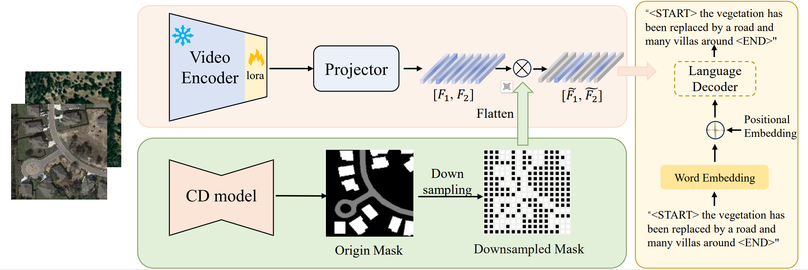

<h1 align="center">MV-CC: Mask Enhanced Video Model for Remote Sensing Change Caption</h1>

<h3 align="center"> Ruixun Liu*, Kaiyu Li*, Jiayi Song*, Dongwei Sun, Xiangyong Cao
<br





### Preparation
- Install the required packages: `pip install -r requirements.txt`
- Download the remote sensing change captioning datasets. We have adopted [LEVIR-MCI](https://github.com/Chen-Yang-Liu/Change-Agent) in this repository.
- The data structure of LEVIR-MCI is organized as follows:

```
├─/root/Data/LEVIR-MCI-dataset/
        ├─LevirCCcaptions.json
        ├─images
             ├─train
             │  ├─A
             │  ├─B
             │  ├─label
             │  ├─semi_mask
             │  ├─supervised_mask
             │  ├─video_data
             ├─val
             │  ├─A
             │  ├─B
             │  ├─label
             │  ├─semi_mask
             │  ├─supervised_mask
             │  ├─video_data
             ├─test
             │  ├─A
             │  ├─B
             │  ├─label
             │  ├─semi_mask
             │  ├─supervised_mask
             │  ├─video_data
```
where folder A contains images of pre-phase, folder B contains images of post-phase.

The semi_mask represents labels obtained from the 5% semi-supervised method, while supervised_mask represents using supervised method.

They can be acquired by using the [SemiCD](https://github.com/wgcban/SemiCD) method.

To generate the video and prepare the data:

```
$ python generate_MP4.py
$ python preprocess_data.py
```
Download the video_encoder.pth from [MV-CC checkpoints](https://drive.google.com/drive/folders/1bmMwyL4WNZcNE_vxTU5esLzL9lMy2s5H?usp=sharing) and put it in checkpoints folder.

Download the model from [InternVideo2_Chat_8B_InternLM2_5](https://huggingface.co/OpenGVLab/InternVideo2_Chat_8B_InternLM2_5) and place it in the /root/video_model folder.

### Training
- Ensure you have completed the data preparation steps above, and then proceed to train the model as follows:
```
$ python train_video_sty.py
```

!NOTE: If the program encounters the error: "'Meteor' object has no attribute 'lock'," we recommend installing it with `sudo apt install openjdk-11-jdk` to resolve this issue.

Alternatively, you can obtain our pretrained models from [MV-CC checkpoints](https://drive.google.com/drive/folders/1bmMwyL4WNZcNE_vxTU5esLzL9lMy2s5H?usp=sharing).

### Caption Generation
- To generate captions, run the following command:
```
$ python test_video_sty.py
```

### Mask mode
Mask mode is set by args.mode

5% semi-supervised method: semi_mask

supervised method: supervised_mask

gt method: label

### Paper
**[MV-CC: Mask Enhanced Video Model for Remote Sensing Change Caption]()**

Please cite the following paper if you find it useful for your research:

```

```

### Acknowledgement

The authors would like to thank the contributors to the [LEVIR-MCI](https://github.com/Chen-Yang-Liu/Change-Agent).

### License
This repo is distributed under [MIT License](https://github.com/liuruixun/MV-CC/blob/main/LICENSE.txt). The code can be used for academic purposes only.
